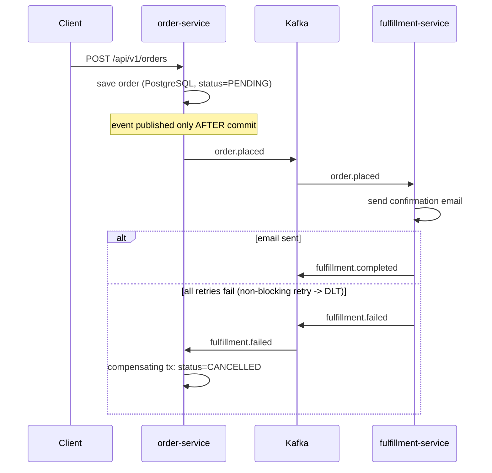
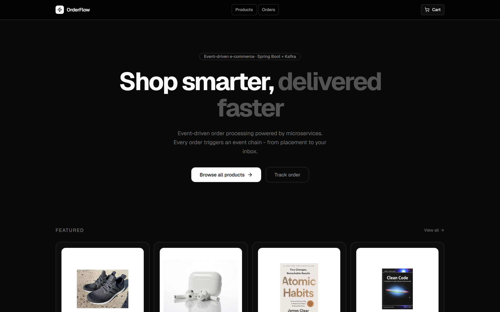
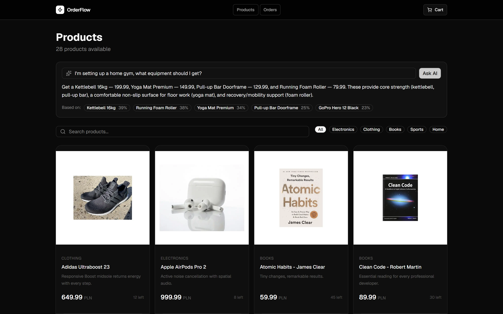

# OrderFlow

E-commerce backend demo showcasing event-driven microservices architecture with four core technologies: **Kafka**, **Redis**, **MongoDB**, and **PostgreSQL**. Runs end-to-end locally via Docker Compose and is deployed live to the cloud (AWS EC2 + managed services) with a Next.js storefront on Vercel.

[]()
[]()
[]()

**Live demo:** [orderflow-frontend-five.vercel.app](https://orderflow-frontend-five.vercel.app) - browse the catalog, semantic search, and an AI shopping assistant (RAG).

**Frontend repository:** [KarimTounsi/orderflow-frontend](https://github.com/KarimTounsi/orderflow-frontend)

## Architecture

```
┌─────────────────────────────────────────────────────────────────┐
│                          AWS EC2                                  │
│                                                                   │
│  ┌─────────────────┐   ┌─────────────────┐   ┌───────────────┐  │
│  │ product-service │   │  order-service  │   │ fulfillment-  │  │
│  │                 │   │                 │   │    service    │  │
│  │  MongoDB        │   │  PostgreSQL     │   │               │  │
│  │  Redis cache    │   │  Kafka producer │   │ Kafka consumer│  │
│  │  Redis cart     │   │  Kafka consumer │   │ Kafka producer│  │
│  └────────┬────────┘   └────────┬────────┘   └───────┬───────┘  │
│           │                     │                     │          │
│           └─────────────────────▼─────────────────────┘          │
│                       Confluent Cloud (Kafka)                     │
└─────────────────────────────────────────────────────────────────┘
```

### Order flow and saga choreography

The order lifecycle is a **choreographed saga**: services react to events and emit new
events, with no central orchestrator. If fulfillment ultimately fails, a **compensating
transaction** cancels the order - keeping the system consistent without distributed locks.



## Services

| Service | Port | Technologies | Responsibility |
|---------|------|-------------|----------------|
| product-service | 8081 | MongoDB, Redis, pgvector | Product catalog, shopping cart, semantic search + AI shopping assistant (RAG) |
| order-service | 8082 | PostgreSQL, Kafka | Order placement, event publishing, saga compensation |
| fulfillment-service | 8083 | Kafka, SMTP/SES | Order processing, email confirmation |

## Tech Stack

| Layer | Technology | Why |
|-------|-----------|-----|
| Runtime | Spring Boot 4.0.6, Java 25 | Virtual threads enabled for blocking I/O |
| Messaging | Apache Kafka | Async event-driven communication between services |
| Cache | Redis | Product catalog cache (TTL 5min), shopping cart session (TTL 24h) |
| Document DB | MongoDB | Flexible product schema with variants and attributes |
| Vector search | pgvector + Spring AI | Semantic search and RAG over the catalog; embeddings computed locally with an ONNX model (no external API) |
| Relational DB | PostgreSQL / Supabase | ACID transactions for orders |
| Schema | Flyway | Versioned, repeatable database migrations |
| API docs | springdoc-openapi 3 | Interactive Swagger UI per service |
| Infrastructure | AWS EC2 + Docker Compose | Containerized deployment |
| CI/CD | GitHub Actions | Automated build and test on every push |

## Design decisions worth noting

These are the choices that keep the system correct under failure - the interesting part of an
event-driven system:

- **Transactional Outbox (no dual-write).** `order-service` does not call Kafka inside the DB
  transaction. In the same transaction that saves the order, it writes the event to an `outbox`
  table - so the order and "publish this event" commit atomically, or roll back together. A
  separate `OutboxRelay` (`@Scheduled`) polls unpublished rows with
  `SELECT ... FOR UPDATE SKIP LOCKED`, sends them to Kafka, and only then marks them published.
  This gives at-least-once delivery: an `order.placed` is never lost, even if the app crashes
  right after the commit, and the `SKIP LOCKED` poll stays correct with multiple instances.
- **Idempotent consumer (no double effects).** Because delivery is at-least-once, `order.placed`
  can legitimately arrive more than once. Before processing, `fulfillment-service` claims the
  `orderId` in Redis (atomic `SET NX` with a 24h TTL) and skips duplicates - so an order is
  fulfilled, and its email sent, exactly once. If processing fails the claim is released, so
  `@RetryableTopic` can still retry. Outbox (delivery) and this dedup (effect) are the two halves
  that together turn at-least-once delivery into exactly-once *handling*.
- **Idempotent, durable producer.** Producers run with `acks=all` and `enable.idempotence=true`,
  so a broker failure does not lose messages and a retry does not create duplicates on the wire.
- **Non-blocking retry + DLT.** The consumer uses `@RetryableTopic` (exponential backoff) so a
  transient failure is retried on a separate topic without blocking the listener; exhausted
  messages land in a dead-letter topic handled by `@DltHandler`.
- **Saga compensation.** When fulfillment fails for good, `fulfillment.failed` triggers a
  compensating transaction in `order-service` that moves the order to `CANCELLED`.
- **RAG as a degradable feature, not a hard dependency.** product-service offers semantic search
  and an AI shopping assistant over the catalog. Product text is embedded locally with an ONNX
  model (all-MiniLM-L6-v2, 384 dims, no external API) and stored in pgvector; `/search/ask`
  retrieves the most similar products and lets an LLM answer strictly from that context, refusing
  to invent products when nothing matches (anti-hallucination). The LLM sits behind a feature flag:
  with no API key the service still starts, semantic search keeps working, and only `/ask` returns
  503. Indexing is a best-effort dual-write (catalog write + vector upsert under a deterministic
  id), because a search index is rebuildable (`POST /search/reindex`) - a lost vector is a worse
  result, not a lost order. Contrast with the order path above, where correctness is non-negotiable
  and uses the Outbox.
- **RFC 9457 Problem Details.** All errors are returned as `application/problem+json`
  (Spring `ProblemDetail`) - a standard, tooling-friendly error contract.
- **Schema as code.** Hibernate runs in `validate` mode; Flyway owns the schema via versioned
  SQL migrations, so the app refuses to start if entities and schema drift apart.
- **Type-safe JSON cache.** Redis cache uses the Jackson 3 generic serializer with a polymorphic
  type validator, so cached values deserialize back to their concrete types safely.

## Running Locally

**Prerequisites:** Docker, Java 25 (Maven is provided by the included Maven Wrapper - use `./mvnw`)

```bash
# Start infrastructure (Kafka, Redis, MongoDB, PostgreSQL, Kafka UI)
docker compose up -d

# Start each service
./mvnw spring-boot:run -pl product-service
./mvnw spring-boot:run -pl order-service
./mvnw spring-boot:run -pl fulfillment-service

# Run all tests with coverage
./mvnw verify

# Swagger UI
open http://localhost:8081/swagger-ui.html   # product-service
open http://localhost:8082/swagger-ui.html   # order-service

# View Kafka topics and messages
open http://localhost:8090
```

## What the Demo Shows

| Action | What happens under the hood |
|--------|----------------------------|
| Browse products | MongoDB query, then Redis cache (second request is much faster) |
| Semantic search | Natural-language query is embedded locally (ONNX) and matched against pgvector by cosine similarity |
| Ask the assistant | Retrieves similar products from pgvector, an LLM answers from that context and returns its sources (full RAG) |
| Add to cart | Cart stored in Redis hash with 24h TTL |
| Place order | Saved to PostgreSQL with an `outbox` row in one transaction; `OutboxRelay` then publishes `order.placed` to Kafka |
| Receive confirmation email | fulfillment-service consumes the event (skipping duplicates via Redis) and sends email |
| Email keeps failing | Retried via retry topics, then DLT, then the order is auto-cancelled (saga) |
| Kafka UI at :8090 | Real-time view of events flowing between services |

## Screenshots

The live system - the catalog served from MongoDB/Redis, and the RAG shopping assistant grounding its
answer in pgvector-retrieved products with cited similarity scores:

| Catalog | AI shopping assistant (RAG) |
|---|---|
|  |  |

## Deployment topology

Runs locally via Docker Compose (see above) and is **deployed live** to the cloud. The mapping
for each piece:

| Concern | Local | Cloud (deployed) |
|---------|-------|------------------|
| Services | Docker Compose | AWS EC2 (Docker Compose) |
| Kafka | apache/kafka container | Confluent Cloud |
| MongoDB | mongo container | MongoDB Atlas |
| PostgreSQL | postgres container | Supabase - separate projects for orders and pgvector vectors |
| Redis | redis container | Upstash |
| Email | Mailhog | Mailhog on the instance (SES-ready) |
| Frontend | Next.js dev server | Vercel |

The RAG retrieval (semantic search) runs in production; the LLM answer step (`/ask`) is behind a
feature flag and enabled per environment.

## CI

GitHub Actions runs `mvn verify` (build + all tests + the JaCoCo coverage gate) on Java 25
for every push and pull request. Testcontainers integration tests run on the CI runner's Docker.

## Tests

Each service has unit tests (JUnit 5 + Mockito) and integration tests (Testcontainers:
PostgreSQL, MongoDB; embedded Kafka for the broker). The full flow is also covered by a
Playwright end-to-end suite driving the Next.js frontend against the running services.
JaCoCo enforces minimum **80% line coverage** on `./mvnw verify`.

## Deliberately out of scope (and why)

This is a portfolio/learning demo focused on event-driven patterns. A few production concerns
are intentionally left out - knowing *why* matters as much as the code:

- **Authentication / authorization.** Sessions are a browser-generated id (no login). A real
  system would add Spring Security + JWT and ownership checks on resources.
- **Observability.** No distributed tracing or metrics dashboards yet. In a multi-service,
  Kafka-based system the natural next step is a correlation/trace id propagated through HTTP and
  Kafka headers (Micrometer Tracing + OpenTelemetry) plus Prometheus/Grafana, so a single order
  can be followed across all three services.
- **Secrets management.** Local configs use plain values; production would inject via environment
  variables / a secret manager.
